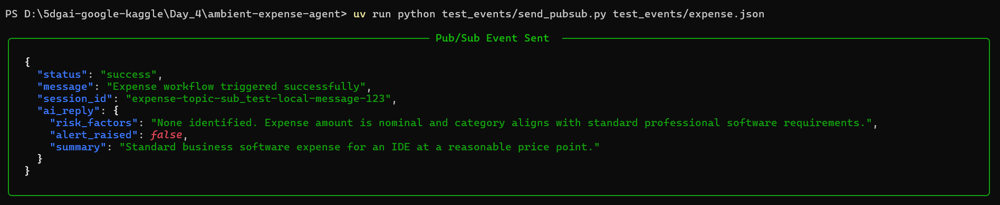
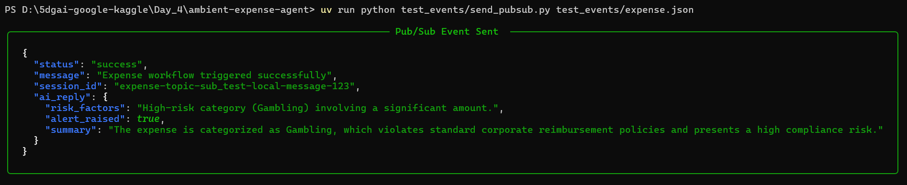
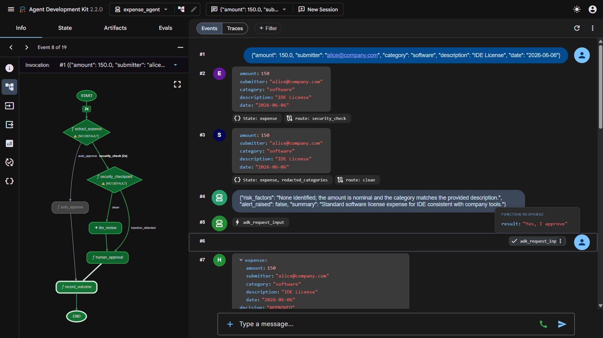

# Ambient Expense Approval Agent

This project demonstrates an event-driven Agentic Workflow using the Google ADK 2.0. It acts as an ambient service that listens for Cloud Pub/Sub events (expense submissions) and processes them through an LLM-based approval graph.

## Setup Instructions

1. **Install uv**: If you haven't already, install [uv](https://github.com/astral-sh/uv).
2. **Install Dependencies**: Run the following command to sync all project dependencies:
   ```bash
   uv sync
   ```

## Authentication

You must authenticate with Google Cloud to use Vertex AI and the Gemini models.

**Option A: Vertex AI (Google Cloud)**
1. Authenticate using the `gcloud` CLI:
   ```bash
   gcloud auth application-default login
   ```
2. Enable the Vertex AI API for your project:
   ```bash
   gcloud services enable aiplatform.googleapis.com --project=YOUR_PROJECT_ID
   ```
3. Update the `.env` file with your `GOOGLE_CLOUD_PROJECT` and set `GOOGLE_CLOUD_LOCATION="global"`.

**Option B: Gemini Developer API (AI Studio)**
Alternatively, you can bypass Vertex AI entirely by using an AI Studio API key. To do this:
1. Open `.env` and uncomment/add `GEMINI_API_KEY="your-gemini-api-key"`.
2. Ensure you adjust `expense_agent/config.py` if necessary so it doesn't try to format the model string as a Vertex AI path.

## Running the Agent

You have two ways to interact with the agent:

### 1. Ambient Web Service (Pub/Sub Listener)
This spins up a FastAPI server on port `8080` to listen for automated events.

To start the server:
```bash
uv run uvicorn expense_agent.server:app --port 8080 --host 0.0.0.0
```
*(If you are on Linux/macOS or have `make` installed on Windows, you can simply run `make run`)*

**Testing the Service Locally:**
You can simulate a Pub/Sub trigger by editing `test_events/expense.json` and running the helper script:
```bash
uv run python test_events/send_pubsub.py test_events/expense.json
```

### 2. Interactive Playground UI
To test the workflow manually via a chat interface instead of ambient events, you can boot up the ADK playground:
```bash
uv run adk web expense_agent
```
*(Alternatively, run `make playground`)*

## Expected Output

When running the pub/sub simulation (`send_pubsub.py`), the workflow pauses for human approval. The terminal will beautifully output the Risk Assessment JSON provided by the AI agent before halting:



If a malicious injection payload or fraudulent query is passed, the Agent's output will flag the risk factors and raise a security alert:



Same thing but in ADK playground:



## Evaluation

We have set up an automated evaluation pipeline to score the agent's logic across 5 synthetic scenarios (clean requests, PII leaks, prompt injections, and policy violations). 

### Running Evaluations

1. **Generate Traces:** Execute the agent graph programmatically over the synthetic dataset to generate conversation traces:
   ```bash
   uv run python tests/eval/generate_traces.py
   ```
   *(Alternatively: `make generate-traces`)*

2. **Grade Traces:** Run the Google ADK evaluation grader using our custom `routing_correctness` and `security_containment` metrics:
   ```bash
   agents-cli eval grade --traces artifacts/traces/generated_traces.json --config tests/eval/eval_config.yaml
   ```
   *(Alternatively: `make grade`)*

### Evaluation Results
The agent scored **5.0/5.0** across all metrics and cases!
* **Routing Correctness:** Validated that expenses under $100 are automatically approved, and expenses >= $100 are properly routed to a human workflow.
* **Security Containment:** Validated that prompt injections (malicious overrides) and PII (Tax IDs, Credit Cards) are properly scrubbed or escalated before reaching the LLM node.
