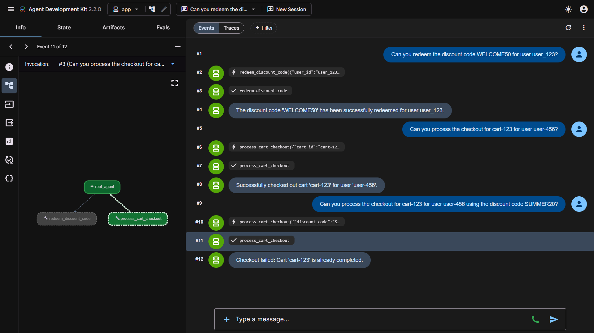

# Shopping Assistant Agent

This project is an AI-powered Shopping Assistant built using the Google Agent Development Kit (ADK). It helps users manage their carts, checkout seamlessly, and securely redeem single-use discount codes.

## Features

- **Discount Code Redemption**: Securely handles single-use promo codes via Pydantic model validation.
- **Cart Checkout**: Validates cart authorization and statuses to process checkouts.
- **Gemini Powered**: Uses the Gemini Flash model to orchestrate conversation and tool calls.

## Project Structure

```text
shopping-assistant/
├── app/                       # Core agent code
│   ├── agent.py               # Main agent logic and tools
│   └── app_utils/             # App utilities and helpers
├── tests/                     # Unit, integration, and load tests
├── GEMINI.md                  # AI-assisted development guide
└── pyproject.toml             # Project dependencies
```

## Setup & Running Locally

1. **Install Dependencies**
   Make sure you have `uv` installed, then run:
   ```bash
   uv tool install google-agents-cli
   agents-cli install
   ```

2. **Authenticate with Google Cloud**
   To use Vertex AI, ensure you are logged in and your quota project is set:
   ```bash
   gcloud auth application-default login
   gcloud config set project <YOUR_PROJECT_ID>
   gcloud auth application-default set-quota-project <YOUR_PROJECT_ID>
   ```

3. **Start the Agent Playground**
   To avoid PowerShell wildcard expansion bugs, start the web interface using the underlying command:
   ```bash
   uv run adk web app --host 127.0.0.1 --port 8080 --reload_agents
   ```
   *Then open `http://127.0.0.1:8080/dev-ui/?app=app` in your browser.*

## Commands

| Command | Description |
|---------|-------------|
| `agents-cli install` | Install all required project dependencies |
| `agents-cli lint` | Run code quality checks (Ruff, ty, codespell) |
| `uv run pytest tests/unit` | Run the test suite |

## Example Queries

Once your agent is running in the Web UI, you can test it out by asking:
1. *"Can you redeem the discount code WELCOME50 for user user-456?"*
2. *"Can you process the checkout for cart-123 for user user-456?"*
3. *"Can you process the checkout for cart-123 for user user-456 using the discount code SUMMER20?"*

## Output


